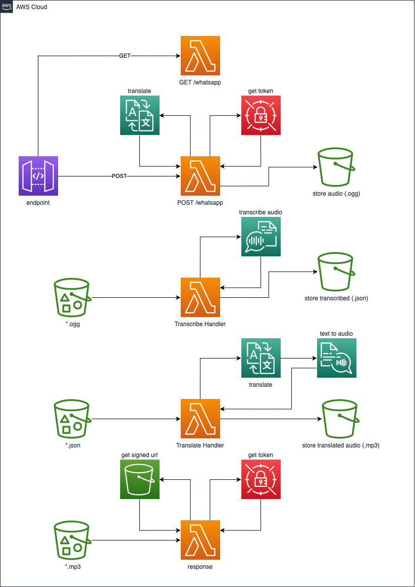

# whatsapp-translation
## Requirements
* [AWS SAM](https://docs.aws.amazon.com/serverless-application-model/latest/developerguide/serverless-sam-cli-install.html)
* [AWS CLI](https://aws.amazon.com/pt/cli/)
* [Node v14](https://nodejs.org/en/blog/release/v14.17.3/)

## Setup AWS CLI
```bash
$ aws cofiguration
```

## Store Whatsapp Secrets
### Create a json file called "secrets.json"
```json
{
    "token": "YOUR TOKEN HERE",
    "phoneNumberId" : "YOUR PHONE NUMBER ID HERE"
}
```
### Run "aws secretsmanager" in order to store the secrets
```bash
$ aws secretsmanager create-secret --name whatsapp  --secret-string file://secrets.json
```

## Translation Languages
### You can modify the translation language and voice by changing the environment variables:
```yaml
  SOURCE_LANGUAGE: pt
  TARGET_LANGUAGE: en
  POLLY_LANGUAGE: en-US
  POLLY_VOICE: Salli
```
Check the [Supported languages and language codes](https://docs.aws.amazon.com/translate/latest/dg/what-is-languages.html)
Check the [Supported voices in Amazon Polly](https://docs.aws.amazon.com/polly/latest/dg/voicelist.html)

## Deployment
```bash
$ sam build
```
```bash
$ sam deploy --guided
```
## Before deployment
* create a Business App in [Meta for Developers](https://developers.facebook.com)
* get the Access Token and Phone number ID

## After deployment
* create a "Whatsapp Business Account" webhook and subscribe for "messages"
* use the Api Gateway Endpoint created by deploy with the path "/whatsapp" as callback URL, e.g.: (https://xxxxx.execute-api.us-east-1.amazonaws.com/Prod/whatsapp)
* use the word "VERIFY" as Verify token for callback URL.

## Architecture
